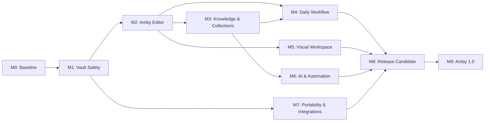

# Amby — roadmap к версии 1.0

> **Цель:** создать полностью open-source local-first knowledge workspace для
> личных заметок и проектов, который объединяет владение Markdown-файлами и
> сильную навигацию в духе Obsidian с удобством Properties, Collections, views
> и workspace-подхода в духе Notion. Amby не должен быть копией ни одного из
> этих продуктов.

Roadmap описывает продукт, а не набор обязательных клонов чужих функций.
Совместимость с Obsidian важна как защита данных и способ постепенно открыть
существующий vault, но глубокая совместимость не является блокером для каждой
функции Amby.

## Содержание

1. [Продуктовая позиция](#1-продуктовая-позиция)
2. [Границы версии 1.0](#2-границы-версии-10)
3. [Модель совместимости](#3-модель-совместимости)
4. [Текущее состояние](#4-текущее-состояние)
5. [Карта релизов](#5-карта-релизов)
6. [Подробный план](#6-подробный-план)
7. [Сквозные требования](#7-сквозные-требования)
8. [Definition of Done](#8-definition-of-done)
9. [Риски и решения](#9-риски-и-решения)
10. [После версии 1.0](#10-после-версии-10)

---

## 1. Продуктовая позиция

### 1.1. Что такое Amby

Amby — полностью open-source local-first рабочее пространство прежде всего для
личных заметок и проектов. Архитектура должна оставаться модульной, чтобы
разные люди могли включать собственные сценарии, модули и уровень сложности,
не превращая продукт в перегруженную универсальную систему.

Его основа:

- пользователь владеет Markdown-файлами и вложениями;
- быстрые ссылки, backlinks, граф и Canvas дают опыт knowledge management;
- Properties, Collections, table/list/board views и составные workspace дают
  структурированный опыт без необходимости превращать всё в отдельные базы;
- блочный редактор на базе Tiptap и исходный Markdown-редактор остаются двумя
  равноправными способами работы с одним документом;
- заметка может оставаться обычным Markdown-файлом, а структурированные функции
  добавляют удобство поверх него;
- AI является помощником внутри рабочего процесса, а не обязательным облачным
  сервисом.

### 1.2. Принятые продуктовые решения

| Область               | Решение                                                                                                                             |
| --------------------- | ----------------------------------------------------------------------------------------------------------------------------------- |
| Позиционирование      | Local-first гибрид Obsidian + Notion с самостоятельным UX Amby                                                                      |
| Основной пользователь | Человек, ведущий личные заметки и проекты; модули расширяют сценарии для разных людей                                               |
| Лицензирование        | Основной продукт полностью open-source, без закрытого ядра и обязательного облака                                                   |
| Источник данных       | Markdown и вложения принадлежат пользователю; SQLite — только индекс                                                                |
| Редактор              | Блочный редактор на Tiptap и исходный Markdown/source editor работают с одним документом                                            |
| Совместимость         | Сначала сохранность и переносимость, затем удобство; идеальная совместимость не обязательна для каждой функции                      |
| Уникальная ценность   | Open-source local-first UX, два режима редактирования, Properties/Collections, модульность и безопасная работа с локальными данными |
| Внешний вид           | Собственная модель workspace, а не копирование интерфейса Obsidian или Notion                                                       |
| Мобильная версия      | Не входит в 1.0                                                                                                                     |
| Git                   | Обязателен в 1.0 как часть локального versioning/workflow; не заменяет Markdown как источник правды                                 |
| E2EE sync             | Эксперимент после доказательства локальной модели; не обязательный release gate 1.0                                                 |
| Self-hosting          | После стабилизации sync-протокола; не обязательный release gate 1.0                                                                 |
| Plugin API            | Сначала внутренний module seam и first-party расширения; публичный runtime после стабилизации ядра                                  |
| AI                    | В 1.0 доступны локальные и облачные провайдеры с явным выбором data flow                                                            |
| Canvas                | В 1.0 нужен полноценный редактор собственного Canvas-формата; глубокая совместимость с Excalidraw — отдельный уровень               |
| Совместная работа     | После 1.0                                                                                                                           |
| Публикация            | После 1.0                                                                                                                           |

### 1.3. Главный инвариант

> Ни одна функция Amby не должна молча уничтожать или делать недоступными
> пользовательские заметки, вложения или поддерживаемые визуальные файлы.

Если Amby не умеет безопасно представить конструкцию в визуальном редакторе,
он сохраняет её как Source-only, opaque block или предлагает отказаться от
операции. Это важнее полноты списка поддерживаемых форматов.

### 1.4. Рабочее решение по Collections

Collection — это сохранённое представление набора Markdown-заметок и их
Properties, а не отдельная закрытая база данных. Рабочее направление для 1.0:

- определение Collection хранится в обычной Markdown-странице с документированным
  frontmatter;
- строки и значения берутся из заметок и Properties, а не копируются в отдельное
  хранилище;
- layout, фильтры, сортировка и grouping являются переносимым описанием view;
- временный индекс SQLite остаётся производным и может быть пересоздан.

То есть пользователь открывает Collection как страницу, а не получает новый
закрытый database-файл. Формат можно уточнить после первого прототипа, но
источник содержимого не должен измениться.

---

## 2. Границы версии 1.0

### 2.1. Обязательное ядро 1.0

- Надёжный локальный vault без аккаунта и интернета.
- Markdown/source editor, Live Preview и безопасный режим чтения.
- Properties: просмотр и редактирование основных типов без потери неизвестного
  YAML.
- Собственная модель блоков, которая остаётся переносимой и понятной как Markdown.
- Collections поверх Markdown и Properties: table, list и board views; фильтры,
  сортировка, grouping и сохранённые представления.
- Wikilinks, backlinks, outgoing links, unresolved links и базовый граф.
- Templates, Daily Notes и базовый task workflow.
- Workspace: tabs, split, focus mode, named layouts/presets, recent items и
  быстрый переход.
- Полноценный Canvas-редактор собственного формата: создание и редактирование
  nodes/edges, pan/zoom, selection, grouping, resize, undo/redo, search и
  безопасное сохранение неизвестных полей.
- AI-панель с локальными и подключаемыми внешними провайдерами; без требования
  отправлять заметки в облако.
- Git status/diff/commit, история, pull/push/fetch и понятный conflict workflow.
- История, backup, recovery drafts, внешние конфликты и безопасные rename/move.
- Импорт существующего Markdown-vault без необратимой миграции.
- Стабильная Windows-сборка и рабочий путь на macOS/Linux без архитектурных
  блокеров.

### 2.2. Желательно, но не должно задерживать 1.0

- Более глубокая совместимость Canvas.
- Полный round-trip для Excalidraw и расширенных чужих Canvas-форматов.
- Дополнительные view-типы: gallery и calendar.
- Локальные semantic/AI queries за feature flag.

### 2.3. После 1.0

- Полноценный Excalidraw editor с round-trip неизвестных полей.
- Полноценный E2EE sync и self-hosted server.
- Публичный plugin runtime, marketplace и подписанные packages.
- Одновременное редактирование, shared vault и роли.
- Web client, mobile apps и публикация.

### 2.4. Явно не является целью 1.0

- Бинарная совместимость с плагинами Obsidian.
- Полное повторение интерфейса Obsidian.
- Полное повторение интерфейса Notion.
- Закрытая база данных как единственный источник содержимого.
- Обязательное облако или аккаунт.

---

## 3. Модель совместимости

Совместимость разделяется на уровни. Для каждой функции в спецификации нужно
явно указать, какой уровень она обещает.

| Уровень              | Обещание                                                      | Пример                                                          |
| -------------------- | ------------------------------------------------------------- | --------------------------------------------------------------- |
| A — Preservation     | Неизвестное содержимое не теряется и не нормализуется молча   | Footnotes или неизвестный HTML открываются в Source-only        |
| B — Interoperability | Amby и другие Markdown-приложения понимают общий смысл данных | Frontmatter, обычные ссылки, теги, задачи, базовые Canvas nodes |
| C — Deep support     | Есть полноценный визуальный UX и проверенный round-trip       | Собственный Amby Canvas format или будущий Excalidraw editor    |

Правила:

- Любая новая функция сначала обязана закрыть уровень A.
- Уровень B нужен для основных пользовательских сценариев.
- Уровень C реализуется только для функций, которые оправданы продуктовой
  ценностью Amby и имеют тестовый формат.
- «Совместимо» нельзя писать без указания уровня, версии формата и ограничений.
- Obsidian используется как важный interop-тест, но не является единственным
  эталоном UX.

---

## 4. Текущее состояние

### 4.1. Уже есть

- Tauri 2, React 19, TypeScript, Rust и SQLite index.
- Локальный vault, файловое дерево, tabs, split view, navigation history.
- Tiptap Live/Read mode и CodeMirror Source mode.
- Wikilinks, transclusion, tags, callouts, tasks, tables и opaque Markdown nodes.
- Базовый link graph, outgoing links, backlinks и unresolved nodes.
- Canvas editor с text/file/group nodes, edges, drag-and-drop и autosave.
- Слои Canvas, database и Excalidraw как архитектурная основа workspace.
- Properties read-only panel; полноценного редактора Properties ещё нет.
- History snapshots, retention, trash, conflict dialog и recovery drafts.
- Preflight ID migration, atomic writes, Rust watcher и incremental index updates.
- Workspace presets, layouts, focus mode, favorites, settings и AI panel.
- CI, generated bindings, frontend/Rust tests и startup diagnostics.

### 4.2. Недавние UI-изменения

В августе 2026 года завершена переработка поверхности workspace в сторону
собственного современного desktop-интерфейса: floating tabs, unified note
surface, dock-aware sidebars, resize feedback, focus mode, подсказки на русском
и английском, а также production frontend build.

### 4.3. Что сейчас считается незавершённым

- Frontmatter safety для BOM/CRLF и полная транзакционность ID migration.
- Политика добавления Amby IDs без неожиданной записи в vault.
- mtime/index invalidation на высокой частоте изменений.
- Настоящий редактируемый Properties слой.
- Collections engine и сохранённые views.
- Unlinked mentions, alias ambiguity и контекст backlinks.
- FTS/operators/large-vault search.
- Templates, Daily Notes и общий task dashboard.
- Полный Amby Canvas editor, unknown-field preservation и golden compatibility fixtures.
- Полноценный Excalidraw UX.
- Git UI, sync protocol и публичный plugin runtime.
- Performance, accessibility, security review и release engineering.

---

## 5. Карта релизов

| Веха                                | Назначение                 | Главный результат                                      |
| ----------------------------------- | -------------------------- | ------------------------------------------------------ |
| **M0 — Baseline**                   | Воспроизводимая разработка | Проверки, окно, CI и диагностика                       |
| **M1 — Vault Safety**               | Защита данных              | Безопасный локальный источник правды                   |
| **M2 — Amby Editor**                | Собственный редактор       | Блоки, Properties и portable Markdown model            |
| **M3 — Knowledge & Collections**    | Структура знаний           | Ссылки, поиск, Collections и views                     |
| **M4 — Daily Workflow**             | Ежедневная работа          | Templates, Daily Notes, Tasks и commands               |
| **M5 — Visual Workspace**           | Визуальное мышление        | Полный Amby Canvas editor, embeds и workspace surfaces |
| **M6 — AI & Automation**            | Помощь в работе            | AI actions, local context и безопасные automations     |
| **M7 — Portability & Integrations** | Переносимость              | Git baseline, import/export и interop reports          |
| **M8 — Release Candidate**          | Стабилизация               | Performance, accessibility, security и migration       |
| **M9 — Amby 1.0**                   | Выпуск                     | Подписанный и документированный релиз                  |

### Зависимости

---

## 6. Подробный план

## M0 — Baseline

### M0.1. Runtime и окно

- [x] Декларативно создавать главное окно ровно один раз.
- [x] Восстанавливать и фокусировать существующее окно при повторном запуске.
- [x] Иметь startup error path с понятным сообщением и diagnostic export.
- [ ] Провести настоящий smoke-test окна на Windows, macOS и Linux.
- [ ] Проверить WebView2 failure и повторный запуск на чистой машине.

### M0.2. Команды и качество

- [x] `npm run dev`, `npm run tauri dev`, `npm run build`, `npm run verify`.
- [x] Rust check/test/clippy и generated IPC bindings.
- [x] CI для frontend, Rust и Windows bundle.
- [ ] Исправить расхождение регистра имён веток в CI и git workflow.
- [ ] Сделать форматирование отдельным понятным blocking/non-blocking policy.

### M0.3. Диагностика

- [x] Structured frontend/Rust logs с уровнями error/warn/info/debug.
- [x] Безопасный диагностический отчёт без note content, paths и secrets.
- [x] Startup recovery screen.
- [ ] Добавить ручной checklist для критических runtime-сценариев.

**Критерий M0:** чистый clone проверяется одной командой, окно запускается
предсказуемо, а failure path не оставляет пользователя без объяснения.

## M1 — Vault Safety

### M1.1. Источник правды и metadata

- [x] Markdown/attachments остаются источником правды.
- [x] `.amby/` и rebuildable SQLite index документированы.
- [x] Служебные каталоги исключаются из индекса.
- [x] User-managed и duplicate IDs не перезаписываются автоматически.
- [ ] Разрешить BOM и LF/CRLF в frontmatter parser без потери envelope.
- [ ] Запретить скрытое добавление ID во время обычного watcher/index refresh.

### M1.2. Безопасные изменения

- [x] Read-only preflight, backup, preview и migration journal.
- [x] Atomic write с temporary sibling, sync и failure tests.
- [x] Per-file autosave queue и stale-buffer guard.
- [ ] Сделать ID migration транзакционной: rollback при частичном сбое.
- [ ] Синхронизировать fsync/rename semantics с требуемой durability policy.

### M1.3. Внешние изменения и восстановление

- [x] Rust watcher отличает собственные события от внешних.
- [x] Clean buffers перезагружаются, dirty buffers открывают conflict dialog.
- [x] Есть accept external, keep local, manual merge и conflict copy.
- [x] Snapshots, retention, restore, trash и recovery drafts.
- [ ] Представлять настоящий diff, а не только два полных текста.
- [ ] Не пропускать быстрые изменения одинакового размера: использовать точный mtime/content stamp.
- [ ] Покрыть burst, Git checkout и external rename/move интеграционными тестами.

### M1.4. Rename/move

- [x] Preview плана и rollback filesystem mutation.
- [x] Resolved wikilinks, базовые Markdown links и JSON references обновляются.
- [ ] Полностью покрыть aliases, URL encoding, attachment refs и ambiguous targets.
- [ ] Snapshot всех изменяемых источников до refactor.
- [ ] Подтвердить операцию на реальном test vault.

**Критерий M1:** приложение нельзя безопасно назвать готовым к реальному vault,
пока BOM/CRLF, partial migration, watcher stamp и rollback не закрыты.

## M2 — Amby Editor

### M2.1. Portable document model

- [x] Source mode и lossless guard для неподдерживаемых конструкций.
- [x] Opaque nodes/tokens для HTML, embeds, callouts, math и Amby blocks.
- [x] Cursor/selection mapping между Source и Live mode.
- [ ] Отделить общий block model от Tiptap-specific representation.
- [ ] Зафиксировать portable Markdown representation для собственных блоков.

### M2.2. Properties

- [ ] Редактирование text, number, checkbox, date, datetime, list, tags и links.
- [ ] Сохранение неизвестных YAML keys, comments, ordering и formatting.
- [ ] Безопасный preview изменения frontmatter.
- [ ] Aliases как отдельная сущность, не только строка в YAML.
- [ ] Validation warnings без запрета ручного Source editing.

### M2.3. Amby blocks

- [ ] Block handles, drag/reorder и block-level commands.
- [ ] Перемещение блока без изменения соседнего Markdown.
- [ ] Callout, quote, task, embed и database-view blocks.
- [ ] Fallback Source-only для блока, который нельзя сериализовать безопасно.

**Критерий M2:** пользователь получает самостоятельный редактор Amby, а
неизвестная разметка не превращается в скрытую потерю данных.

## M3 — Knowledge & Collections

### M3.1. Knowledge core

- [ ] Разрешение links по path, title и alias с отчётом об ambiguity.
- [x] Outgoing links, backlinks и unresolved links в базовом виде.
- [ ] Backlinks с контекстом и переходом к heading/block.
- [ ] Unlinked mentions с предложением создать ссылку.
- [ ] Outline, bookmarks, saved searches и scroll/cursor state.
- [ ] Local graph, global graph, filters, depth и graph presets.

### M3.2. Search

- [ ] SQLite FTS5 для title, body, path, tags и properties.
- [ ] Incremental update без полного чтения vault.
- [ ] Операторы `path:`, `tag:`, `property:`, `task:` и `link:`.
- [ ] Фразы, исключения, grouping, snippets и highlighted matches.
- [ ] Rebuild/diagnostics для повреждённого индекса.
- [ ] Benchmark на 1k, 10k и 100k notes.

### M3.3. Collections

- [ ] Определить on-disk описание Collection/view.
- [ ] Источник строк — Markdown notes и Properties, не закрытая content database.
- [ ] Table view с inline editing через безопасный Properties layer.
- [ ] List view.
- [ ] Board/Kanban view.
- [ ] Filters, sorting, grouping и saved views.
- [ ] Empty/error/loading states и понятное объяснение происхождения данных.

**Критерий M3:** пользователь может организовать проект как набор заметок,
Properties и views, не превращая Amby в закрытую базу.

## M4 — Daily Workflow

### M4.1. Commands и navigation

- [ ] Единый command registry и fuzzy command palette.
- [ ] Контекстные команды для note, block, collection и workspace.
- [ ] Настраиваемые shortcuts и conflict detection.
- [ ] Quick open, recent items и quick capture/inbox.

### M4.2. Templates и periodic notes

- [ ] Папка шаблонов и создание note из template.
- [ ] Insert at cursor/selection.
- [ ] Variables: date, time, title, path, selection.
- [ ] Safe preview и пользовательские prompts.
- [ ] Daily, weekly, monthly and yearly notes.
- [ ] Locale/timezone без смещения даты.

### M4.3. Tasks

- [ ] Индекс всех задач vault.
- [ ] Status characters, due/scheduled/start/completion dates.
- [ ] Фильтры, группировка, сортировка и task views.
- [ ] Изменение задачи из dashboard с записью в исходный Markdown.
- [ ] Recurring tasks после определения portable representation.

### M4.4. Workspace

- [x] Tabs, split, focus mode, presets и session restore foundation.
- [ ] Named workspaces с независимыми layouts и collections.
- [ ] Pinned tabs и недавние изменения.
- [ ] Per-workspace command/context state.

**Критерий M4:** ежедневный сценарий заметка → структура → задача → обзор
закрывается внутри Amby без обязательного перехода в другое приложение.

## M5 — Visual Workspace

### M5.1. Canvas

- [x] Базовые text/file/group nodes, edges, colors, drag/drop и autosave.
- [ ] Зафиксировать поддерживаемую версию/подмножество Canvas JSON.
- [ ] Полный редактор собственного Canvas-формата: pan/zoom, selection,
      multi-select, grouping, resize, connectors, keyboard controls, copy/paste и
      undo/redo.
- [ ] Создание и редактирование Canvas nodes/edges без обязательного перехода
      в другой инструмент.
- [ ] Сохранять unknown root/node/edge fields.
- [ ] Не менять координаты и размеры без действия пользователя.
- [ ] Canvas search, navigation и golden fixtures.
- [ ] Source-only fallback для неизвестных Canvas constructs.

### M5.2. Rich visual surfaces

- [ ] Whiteboard/Canvas surface с собственными Amby blocks.
- [ ] Embedding note, collection view и media без закрытой миграции.
- [ ] Excalidraw — безопасный view/embed с сохранением исходника; глубокий
      round-trip и полноценный редактор остаются отдельным compatibility scope.
- [ ] Проверить, какие visual features действительно отличаются от Canvas и
      оправдывают отдельный формат.

**Критерий M5:** пользователь может полноценно создавать и редактировать
собственные Canvas-документы внутри Amby, а визуальные поверхности усиливают
Amby workflow и не являются простым копированием чужого приложения.

## M6 — AI & Automation

- [x] AI panel с несколькими провайдерами.
- [ ] Context picker: current block, note, selection, collection или workspace.
- [ ] Actions: summarize, rewrite, extract properties, create tasks и query collection.
- [ ] Preview перед записью AI-результата.
- [ ] Явный индикатор, какие данные покидают устройство.
- [ ] Локальные провайдеры (включая Ollama-путь) и облачные провайдеры доступны
      в одной модели переключения.
- [ ] Облачный режим явно требует подтверждения передачи контекста и не меняет
      настройки приватности молча.
- [ ] Feature flags для semantic search и автоматических действий.

**Критерий M6:** AI сокращает ручную работу, но не получает скрытый доступ к
vault и не изменяет заметки без подтверждения пользователя.

## M7 — Portability & Integrations

### M7.1. Git baseline

- [ ] Обнаружение repository и status по Markdown/assets/Canvas.
- [ ] Readable diff и история файла.
- [ ] Выбор файлов для commit, pull/push/fetch.
- [ ] Conflict editor поверх уже существующего conflict model.
- [ ] Credentials через OS keychain/SSH agent.
- [ ] Git workflow входит в обязательный 1.0 release gate и проверен на реальном
      test vault.

### M7.2. Import/export

- [ ] Compatibility report по уровням A/B/C.
- [ ] Read-only preflight и backup перед изменениями.
- [ ] Export portable Markdown + assets + documented Amby metadata.
- [ ] Отчёт об unsupported features без ложного обещания полной совместимости.

### M7.3. Extension seam

- [x] Внутренний module registry и lifecycle seam.
- [ ] First-party modules для Collections, Tasks и Templates используют этот seam.
- [ ] Зафиксировать минимальный API только после стабилизации core workflows.
- [ ] Публичный sandboxed plugin runtime перенести после 1.0.

**Критерий M7:** переносимость и интеграции не заставляют Amby копировать чужую
архитектуру и не создают новый закрытый lock-in.

## M8 — Release Candidate

- [ ] Vault generators: tiny, compat, broken, 1k, 10k и 100k.
- [ ] Performance budgets для startup, indexing, switching, search и memory.
- [ ] Background indexing и virtualization тяжёлых списков.
- [ ] Keyboard navigation, focus management, screen-reader labels, contrast,
      high-DPI и reduced motion.
- [ ] Tauri permissions, path traversal, symlink, CSP и asset protocol review.
- [ ] Dependency audit, SBOM и secrets review.
- [ ] Migration/backup/restore на копиях реальных vault.
- [ ] Onboarding и понятные empty/error/loading/progress states.
- [ ] English/Russian localization; Ukrainian добавляется только если покрыта
      реальная продуктовая потребность.

**Критерий M8:** нет critical/high data-loss bugs, известные ограничения
документированы, а core workflows подтверждены на копиях реальных данных.

## M9 — Amby 1.0

### M9.1. Release engineering

- [ ] Versioning приложения и portable metadata format.
- [ ] Подписанный installer и проверенный updater/rollback.
- [ ] Stable/beta channels, release notes и migration notes.
- [ ] Reproducible release checklist и crash diagnostics.

### M9.2. Документация

- [ ] Начало работы и модель Amby workspace.
- [ ] Работа с Markdown/Obsidian vault по уровням совместимости.
- [ ] Properties, Collections, Templates, Tasks и Canvas guide.
- [ ] Backup, history, conflict и recovery guide.
- [ ] Git workflow и известные ограничения 1.0.

### M9.3. Финальные release gates

- [ ] Нет известных critical/high data-loss bugs.
- [ ] Все миграции обратимы или имеют documented recovery path.
- [ ] A-level preservation suite проходит полностью.
- [ ] Основные B-level interop-сценарии проходят на тестовых vault.
- [ ] Core Amby workflows закрываются без обязательного использования Obsidian.
- [ ] Collections, Properties, Templates, Tasks, Workspace и полноценный Amby
      Canvas editor соответствуют спецификациям.
- [ ] Установщик, обновление и rollback проверены на чистой Windows VM.

---

## 7. Сквозные требования

### 7.1. Стратегия тестирования

| Уровень     | Что проверяет                                                         |
| ----------- | --------------------------------------------------------------------- |
| Unit        | Parser, paths, migrations, queries, reducers, serializers             |
| Golden      | Markdown, frontmatter, Amby Canvas format и portable blocks           |
| Integration | Rust commands, SQLite, watcher, refactor и Git                        |
| Component   | Editor, Properties, Collections, search, tasks и dialogs              |
| E2E         | Vault open, edit, collection view, rename, conflict, restore и update |
| Chaos       | Crash, partial write, corrupted index и external bursts               |
| Performance | Startup, indexing, search, graph, collections и memory                |
| Security    | Permissions, paths, secrets, AI data flow и future plugins            |

### 7.2. Обязательные test vaults

- `tiny-vault`: базовые Markdown, Properties, links, tasks и blocks.
- `compat-vault`: обезличенный реальный Markdown/Obsidian vault.
- `broken-vault`: malformed YAML, duplicate IDs, broken links, BOM/CRLF и invalid UTF-8.
- `collections-vault`: разнотипные Properties для table/list/board views.
- `large-vault`: 10k заметок.
- `stress-vault`: 100k заметок и вложения.
- `recovery-vault`: external edits, crashes, rename, trash и restore.

### 7.3. Feature flags

Экспериментальные возможности не меняют on-disk формат без явного согласия:

- `experimental.e2eeSync`;
- `experimental.pluginRuntime`;
- `experimental.semanticSearch`;
- `experimental.formulaFields`;
- новые Markdown/Canvas nodes;
- AI actions, которые могут массово изменять заметки.

---

## 8. Definition of Done

### Для задачи

- [ ] Пользовательское поведение и edge cases согласованы.
- [ ] Указано, относится ли функция к Amby UX, уровню A, B или C совместимости.
- [ ] Реализация завершена.
- [ ] Есть автоматические тесты и ручной критический сценарий.
- [ ] Нет необработанного риска потери данных.
- [ ] Ошибки, ограничения и data flow понятны пользователю.
- [ ] Формат хранения документирован.
- [ ] `npm run build`, Vitest и необходимые Rust checks проходят.

### Для milestone

- [ ] Все задачи имеют Definition of Done.
- [ ] Нет critical/high bugs в области milestone.
- [ ] Пройдены regression и compatibility tests соответствующего уровня.
- [ ] Проверено обновление с предыдущего milestone.
- [ ] Зафиксированы performance/security metrics, если они применимы.
- [ ] Milestone принят на копии реального test vault.

### Для версии 1.0

- [ ] Пользователь может неделю работать в Amby в основных сценариях note,
      Properties, Collections, tasks и workspace.
- [ ] После этого исходные Markdown-файлы остаются пригодными для других
      редакторов, включая Obsidian, в пределах заявленного уровня совместимости.
- [ ] История, backup и recovery позволяют вернуться после ошибочного действия.
- [ ] Core Amby UX не зависит от облака, аккаунта или закрытой базы.
- [ ] Git является рабочей частью 1.0, а локальный AI остаётся доступным без
      обязательного облака.
- [ ] Полноценный Amby Canvas editor работает в пределах собственного
      документированного формата.
- [ ] Ограничения Excalidraw и Markdown явно документированы.

---

## 9. Риски и решения

### Риск 1. Amby превратится в неясную смесь Obsidian и Notion

**Опасность:** продукт будет копировать интерфейсы, но не даст цельного workflow.

**Решение:** сначала описывать собственные сценарии и mental model Amby, затем
выбирать знакомые паттерны только там, где они помогают.

### Риск 2. WYSIWYG меняет пользовательский Markdown

**Опасность:** serializer удалит неизвестную разметку или нормализует файл.

**Решение:** уровень A Preservation, opaque nodes, Source-only fallback и
golden round-trip tests. Полная визуальная поддержка не обязательна.

### Риск 3. Properties и Collections станут закрытой базой

**Опасность:** пользователь потеряет переносимость и получит новый lock-in.

**Решение:** Markdown/properties остаются источником данных; Collection — это
описание view и индекс, который можно перестроить.

### Риск 4. Служебный ID изменит существующий vault

**Опасность:** даже полезная миграция создаст неожиданный Git diff.

**Решение:** read-only preflight, backup, preview, явное подтверждение, journal
и rollback. Обычный index refresh не должен писать новые IDs.

### Риск 5. Canvas/Excalidraw займут весь срок разработки

**Опасность:** визуальные форматы сложны и содержат неизвестные поля.

**Решение:** полноценный собственный Amby Canvas editor входит в 1.0 с
preservation; Excalidraw view/embed может войти в 1.0, а глубокий round-trip и
полноценный Excalidraw editor остаются отдельным compatibility scope.

### Риск 6. E2EE и plugins преждевременно зафиксируют архитектуру

**Опасность:** сложные security-sensitive слои будут построены до проверки
основного Amby workflow.

**Решение:** сначала локальное ядро и внутренний module seam, затем threat model,
публичные протоколы и внешний аудит.

### Риск 7. Слишком широкий 1.0

**Опасность:** Properties, Collections, Canvas, AI, Git, sync и plugins
одновременно остановят выпуск.

**Решение:** 1.0 определяется core workflow и сохранностью данных; E2EE,
marketplace и глубокая Excalidraw-совместимость не являются release gates.

---

## 10. После версии 1.0

### 1.1+

- Полноценный Excalidraw editor.
- E2EE sync и self-hosted server.
- Публичный plugin runtime и marketplace.
- Advanced formulas, gallery/calendar views и semantic search.
- Shared vault, comments и review workflow.

### 2.0-кандидаты

- Совместное редактирование в реальном времени.
- Mobile apps.
- Web client.
- Публикация выбранных страниц.
- Организационные пространства и команды.

---

## Рекомендуемый порядок работы

Следующая контрольная точка начинается только после приёмки предыдущей.

1. **M0:** runtime, CI, diagnostics и smoke tests.
2. **M1:** frontmatter safety, ID policy, atomic writes, recovery и refactor.
3. **M2:** Properties, portable blocks и собственный editor foundation.
4. **M3:** links, FTS, Collections и saved views.
5. **M4:** Templates, Daily Notes, Tasks и command workflow.
6. **M5:** полноценный Amby Canvas editor и визуальные surfaces.
7. **M6:** AI context/actions с preview и privacy controls.
8. **M7:** Git baseline, import/export и compatibility reports.
9. **M8–M9:** performance, accessibility, security, migration и выпуск.
10. **После 1.0:** E2EE, full Excalidraw, public plugins и collaboration.

> Roadmap является живым документом. Изменение scope должно фиксировать причину,
> влияние на зависимости, новые риски и обновлённые release gates.
