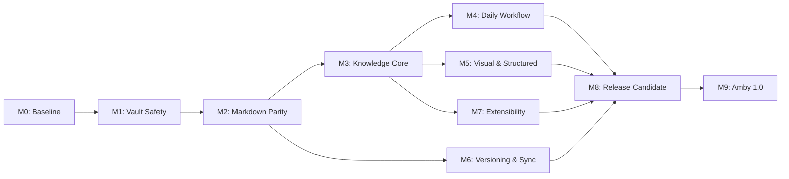

# Amby — roadmap к версии 1.0

> **Цель:** превратить Amby в надёжный, локальный и расширяемый desktop-заметник,
> который может ежедневно использовать тот же vault, что и Obsidian, не повреждая
> данные и не привязывая пользователя к закрытому формату.

---

## Содержание

1. [Продуктовые решения](#1-продуктовые-решения)
2. [Границы версии 1.0](#2-границы-версии-10)
3. [Принципы разработки](#3-принципы-разработки)
4. [Текущее состояние](#4-текущее-состояние)
5. [Карта релизов](#5-карта-релизов)
6. [Подробный план](#6-подробный-план)
7. [Сквозные требования](#7-сквозные-требования)
8. [Definition of Done](#8-definition-of-done)
9. [Риски и сложные решения](#9-риски-и-сложные-решения)
10. [После версии 1.0](#10-после-версии-10)

---

## 1. Продуктовые решения

Эти решения утверждены и являются исходными ограничениями roadmap.

| Область | Решение |
|---|---|
| Совместимость vault | Один vault должен попеременно открываться в Amby и Obsidian без повреждений |
| Идентификаторы | Amby может добавлять служебный `id` во frontmatter заметок |
| Приоритетные возможности | Canvas, Excalidraw, Templates и Databases |
| Расширения | Отдельная экосистема и API плагинов Amby |
| Мобильная версия | Не входит в 1.0 |
| Синхронизация | Git и собственная E2EE-синхронизация |
| Self-hosting | Пользователь может развернуть собственный сервер синхронизации |
| Совместная работа | Нужна в будущем, но не входит в 1.0 |
| Публикация | Нужна в будущем, но не входит в 1.0 |

### Главный инвариант

> Ни одна функция Amby не должна делать существующую заметку, вложение, Canvas или
> Excalidraw-файл непригодными для дальнейшего использования в Obsidian.

---

## 2. Границы версии 1.0

### Входит в 1.0

- Надёжная работа с локальным Markdown-vault.
- Безопасное попеременное использование vault в Amby и Obsidian.
- Lossless-редактирование поддерживаемого Markdown и сохранение неизвестной разметки.
- Properties/frontmatter, wikilinks, backlinks, embeds, tags и граф.
- Быстрый индексированный поиск с операторами.
- Templates, Daily Notes, Periodic Notes и рабочий процесс задач.
- Совместимый Canvas и полноценная работа с Excalidraw-файлами.
- Databases/Collections поверх Markdown и properties.
- Git-интеграция.
- E2EE-синхронизация с официальным и self-hosted сервером.
- Собственный безопасный plugin API Amby.
- Стабильные Windows-сборки; архитектура без блокеров для macOS/Linux.
- Импорт существующего Obsidian vault без необратимой миграции.

### Не входит в 1.0

- Мобильное приложение.
- Одновременное совместное редактирование документа несколькими людьми.
- Публичная публикация vault в интернете.
- Бинарная совместимость с плагинами Obsidian.
- Облачный web-редактор.

Эти возможности планируются после стабилизации форматов и API версии 1.0.

---

## 3. Принципы разработки

### 3.1. Local-first

- Markdown и вложения принадлежат пользователю.
- Приложение полностью работает без интернета и аккаунта.
- SQLite является восстанавливаемым индексом, а не единственным источником данных.
- Удаление `.amby/notes.db` не должно приводить к потере пользовательских данных.

### 3.2. Совместимость важнее удобства реализации

- Неподдерживаемая разметка должна сохраняться без изменений.
- Перед изменением формата создаётся backup и доступен rollback.
- Новые конструкции Amby должны оставаться читаемыми как обычный Markdown.
- Совместимые файлы Obsidian не переименовываются и не конвертируются без согласия пользователя.

### 3.3. Безопасность данных

- Запись файлов — атомарная.
- Rename/move — транзакционный на уровне операции пользователя.
- Конфликт никогда не разрешается молчаливой перезаписью.
- Любое массовое изменение сначала показывает preview и количество затрагиваемых файлов.

### 3.4. Измеримая готовность

Каждая задача считается завершённой только после:

1. реализации;
2. автоматических тестов;
3. ручной проверки критического сценария;
4. документации поведения и ограничений;
5. проверки на реальном тестовом vault.

---

## 4. Текущее состояние

### Уже реализована сильная основа

- Tauri 2, React 19, TypeScript и Rust.
- Markdown-vault и SQLite-индекс.
- Инкрементальное сканирование файлов.
- Отслеживание внешних изменений через Rust watcher.
- Файловое дерево, вкладки, история навигации и split view.
- WYSIWYG-редактор на Tiptap и source-редактор на CodeMirror.
- Wikilinks, tags, embeds/transclusion, callouts, tasks и таблицы.
- Глобальный граф связей.
- Canvas-редактор.
- Работа с изображениями и вложениями.
- Сессии, layouts и presets.
- AI-панель с несколькими провайдерами.
- 80 существующих автоматических тестов проходят.

### Критические пробелы

- Dev-конфигурация способна запустить Tauri без видимого окна.
- Нет формальной гарантии lossless Markdown round-trip.
- Нет истории версий и полноценного crash recovery.
- Rename/move ещё не гарантирует обновление всех ссылок и embeds.
- Текущий поиск линейно просматривает содержимое заметок вместо FTS.
- Нет полноценного UI для properties.
- Backlinks представлены ограниченно; нет unlinked mentions.
- Нет Templates/Daily Notes/общего task dashboard.
- Canvas ещё не подтверждён как полностью совместимый с форматом Obsidian.
- Excalidraw и Databases не завершены как пользовательские функции.
- Нет Git UI, E2EE sync и plugin runtime.

---

## 5. Карта релизов

| Веха | Назначение | Главный результат |
|---|---|---|
| **M0 — Baseline** | Воспроизводимая разработка | Проект стабильно запускается и проверяется |
| **M1 — Vault Safety** | Защита данных | Amby безопасен для реального vault |
| **M2 — Markdown Parity** | Совместимость | Заметки не портятся между Amby и Obsidian |
| **M3 — Knowledge Core** | Связи и поиск | Полноценная навигация по знаниям |
| **M4 — Daily Workflow** | Ежедневная работа | Templates, Daily Notes, Tasks, команды |
| **M5 — Visual & Structured** | Canvas/Excalidraw/DB | Замена обязательных плагинов |
| **M6 — Versioning & Sync** | Несколько устройств | Git + E2EE + self-hosting |
| **M7 — Extensibility** | Экосистема | Стабильный plugin API Amby |
| **M8 — Release Candidate** | Полировка | Производительность, безопасность, миграция |
| **M9 — 1.0** | Стабильный выпуск | Подписанный, документированный релиз |

### Зависимости

---

## 6. Подробный план

## M0 — Baseline: стабильный запуск и контроль качества

### M0.1. Исправить жизненный цикл окна Tauri

- [ ] Устранить зависимость dev-окна от неявного поведения Tauri CLI.
- [ ] Создавать главное окно ровно один раз в dev и production.
- [ ] Проверить Windows-конфигурацию с `decorations: false`.
- [ ] Добавить корректное восстановление/фокусирование существующего окна.
- [ ] Проверить повторный запуск приложения.
- [ ] Проверить обработку ошибки создания WebView2.
- [ ] Добавить smoke-тест наличия главного окна.

### M0.2. Стандартизировать команды

- [ ] `npm run dev` — браузерная разработка UI.
- [ ] `npm run tauri dev` — полноценный desktop-режим.
- [ ] `npm run verify` — TypeScript, lint, tests и Rust check.
- [ ] `npm run build` — frontend production build.
- [ ] `npm run tauri build` — desktop bundle.
- [ ] Документировать требования Node, Rust и WebView2.

### M0.3. CI и качество

- [ ] Настроить CI для TypeScript, ESLint, Prettier и Vitest.
- [ ] Добавить `cargo fmt --check`, `cargo clippy` и `cargo test`.
- [ ] Проверять генерацию Tauri bindings.
- [ ] Запретить случайно устаревшие generated-файлы.
- [ ] Добавить сборку Windows artifact на pull request/release.
- [ ] Зафиксировать conventions для migrations и feature flags.

### M0.4. Диагностика

- [ ] Структурированные frontend/Rust logs.
- [ ] Уровни `error`, `warn`, `info`, `debug`.
- [ ] Экспорт диагностического отчёта без содержимого заметок и секретов.
- [ ] Экран восстановления после критической ошибки запуска.

**Критерий M0:** чистый clone запускается предсказуемо, окно всегда видно, все проверки выполняются одной командой.

---

## M1 — Vault Safety: защита пользовательских данных

### M1.1. Спецификация формата vault

- [ ] Описать назначение `.amby/` и каждого служебного файла.
- [ ] Подтвердить, что SQLite всегда можно перестроить из Markdown.
- [ ] Формализовать `id` во frontmatter: имя поля, формат, уникальность и миграции.
- [ ] Не перезаписывать существующий пользовательский `id`.
- [ ] Обрабатывать дубликаты `id` через отчёт и безопасное исправление.
- [ ] Исключить `.obsidian/`, `.git/`, `.trash/` и служебные папки из индекса.
- [ ] Не изменять `.obsidian` settings и plugin data.

### M1.2. Безопасное первое открытие

- [ ] Сначала выполнять read-only scan.
- [ ] Показывать отчёт: заметки, вложения, ошибки YAML, дубликаты и неподдерживаемые файлы.
- [ ] Перед массовым добавлением `id` создавать backup/restore point.
- [ ] Показывать список планируемых изменений.
- [ ] Разрешить отменить миграцию до первой записи.
- [ ] Сохранять журнал выполненной миграции.

### M1.3. Атомарное сохранение

- [ ] Единый Rust API атомарной записи для всех пользовательских файлов.
- [ ] Запись во временный файл рядом с оригиналом.
- [ ] Flush/sync, затем атомарная замена.
- [ ] Сохранение исходных line endings и кодировки UTF-8/BOM.
- [ ] Защита от сохранения устаревшей редакторской версии.
- [ ] Очередь записи отдельно для каждого файла.
- [ ] Тесты падения на каждом шаге записи.

### M1.4. Внешние изменения и конфликты

- [ ] Различать собственные и внешние события watcher.
- [ ] Не терять события во время burst-изменений и Git checkout.
- [ ] Автоматически перечитывать неоткрытый файл.
- [ ] Для открытого изменённого файла показывать diff.
- [ ] Действия: оставить локальное, принять внешнее, объединить, сохранить копию.
- [ ] Не закрывать вкладку молча при внешнем удалении.
- [ ] Корректно обрабатывать rename/move извне.

### M1.5. История и восстановление

- [ ] Локальные snapshots перед рискованной записью.
- [ ] Политика retention по времени и объёму.
- [ ] Просмотр diff между версиями.
- [ ] Восстановление версии как новой операции.
- [ ] Корзина для файлов и папок.
- [ ] Восстановление удалённого дерева и вложений.
- [ ] Crash recovery для несохранённого текста.

### M1.6. Безопасный rename/move

- [ ] До операции строить полный план изменений.
- [ ] Обновлять wikilinks, Markdown links и embeds.
- [ ] Обновлять heading/block links без потери anchor.
- [ ] Обновлять Canvas и Excalidraw references.
- [ ] Обновлять ссылки на вложения.
- [ ] Учитывать aliases и неоднозначные имена файлов.
- [ ] Откатывать всю операцию при ошибке.
- [ ] Показывать preview массового refactor.

**Критерий M1:** ни падение, ни внешнее изменение, ни rename/move не приводят к молчаливой потере данных.

---

## M2 — Markdown Parity: совместимость с Obsidian

### M2.1. Матрица синтаксиса

- [ ] CommonMark и GitHub Flavored Markdown.
- [ ] YAML frontmatter с сохранением неизвестных полей и порядка.
- [ ] Wikilinks: path, alias, heading и block anchors.
- [ ] Embeds заметок, заголовков, блоков и медиа.
- [ ] Obsidian callouts, включая foldable-варианты.
- [ ] Tags, nested tags и tags во frontmatter.
- [ ] Tasks и вложенные списки.
- [ ] Footnotes, comments и reference links.
- [ ] MathJax inline/block math.
- [ ] Mermaid diagrams.
- [ ] Code fences и неизвестные языки.
- [ ] Markdown tables и alignment.
- [ ] Inline/raw HTML.
- [ ] PDF, audio, video и iframe embeds.

### M2.2. Lossless document model

- [ ] Хранить неподдерживаемые конструкции как opaque nodes/tokens.
- [ ] Не нормализовать синтаксис без пользовательского изменения.
- [ ] Сохранять HTML, comments и whitespace там, где это влияет на данные.
- [ ] Отделить визуальную модель редактора от on-disk Markdown AST.
- [ ] Не использовать HTML как скрытый способ сохранения обычного Markdown.

### M2.3. Режимы редактора

- [ ] Source mode с полноценной подсветкой Markdown.
- [ ] Live Preview с inline-разметкой и embeds.
- [ ] Reading mode без возможности случайного редактирования.
- [ ] Синхронизация cursor/selection при переключении режима.
- [ ] Единая история undo/redo в пределах режима.
- [ ] Предсказуемое поведение IME, Unicode и кириллицы.

### M2.4. Compatibility tests

- [ ] Golden fixtures из сложных Obsidian-документов.
- [ ] Parse → serialize без изменений для нетронутого документа.
- [ ] Редактирование одного блока не меняет соседние блоки.
- [ ] Property-based/fuzz tests Markdown parser/serializer.
- [ ] Fixtures с повреждённым YAML и частично валидной разметкой.
- [ ] Сравнение результата повторного открытия в Obsidian.

**Критерий M2:** нетронутая часть документа сохраняется побайтно или семантически эквивалентно согласно зафиксированной спецификации.

---

## M3 — Knowledge Core: properties, ссылки, граф и поиск

### M3.1. Properties

- [ ] Визуальный редактор frontmatter.
- [ ] Типы: text, number, checkbox, date, datetime, list, tags и links.
- [ ] Сохранение неизвестных YAML-типов без потери.
- [ ] Массовое изменение properties с preview.
- [ ] Автодополнение имён и значений.
- [ ] Aliases как системное property.
- [ ] Валидация без блокировки ручного YAML.

### M3.2. Ссылочная модель

- [ ] Разрешение ссылок по path, title и alias.
- [ ] Heading links и block IDs.
- [ ] Backlinks с фрагментом контекста.
- [ ] Outgoing links.
- [ ] Unlinked mentions с возможностью создать ссылку.
- [ ] Отдельное отображение unresolved links.
- [ ] Создание отсутствующей заметки из ссылки.
- [ ] Предупреждение о неоднозначном target.

### M3.3. Навигация

- [ ] Outline текущей заметки.
- [ ] Bookmarks для заметок, заголовков и поисков.
- [ ] Быстрый переход к heading/block.
- [ ] Back/forward history на каждую вкладку.
- [ ] Сохранение scroll и cursor position.
- [ ] Настраиваемый split layout.

### M3.4. Граф

- [ ] Global и local graph.
- [ ] Фильтры по path, tags и properties.
- [ ] Управление глубиной local graph.
- [ ] Скрытие orphan/unresolved nodes.
- [ ] Цветовые группы.
- [ ] Сохранение graph presets.
- [ ] Производительность на больших vault.

### M3.5. FTS-поиск

- [ ] SQLite FTS5 индекс для title, content, path, tags и properties.
- [ ] Инкрементальное обновление одной заметки.
- [ ] Операторы `path:`, `file:`, `tag:`, `property:`, `task:` и `link:`.
- [ ] Фразы, исключения, AND/OR и grouping.
- [ ] Regex как отдельный контролируемый режим.
- [ ] Несколько snippets и подсветка совпадений.
- [ ] Сохранённые запросы.
- [ ] Автоматическая диагностика и rebuild индекса.

**Критерий M3:** основные связи доступны из интерфейса, а поиск остаётся интерактивным на vault из 100 000 заметок.

---

## M4 — Daily Workflow: шаблоны, заметки и задачи

### M4.1. Command Palette и hotkeys

- [ ] Единый реестр команд.
- [ ] Поиск команд и fuzzy matching.
- [ ] Настройка горячих клавиш.
- [ ] Обнаружение конфликтов shortcuts.
- [ ] Контекстные команды редактора/файла/workspace.
- [ ] Plugin-команды через тот же API.

### M4.2. Templates

- [ ] Настраиваемая папка шаблонов.
- [ ] Вставка шаблона в текущую позицию.
- [ ] Создание заметки из шаблона.
- [ ] Переменные даты, времени, title, path и selection.
- [ ] Пользовательские prompts/variables.
- [ ] Безопасный preview результата.
- [ ] Hooks для будущих plugins.

### M4.3. Daily и Periodic Notes

- [ ] Формат имени файла и папки.
- [ ] Daily template.
- [ ] Команды «открыть сегодня/вчера/завтра».
- [ ] Weekly, monthly, quarterly и yearly notes.
- [ ] Calendar navigation.
- [ ] Создание пропущенной заметки по запросу.
- [ ] Локаль и timezone без сдвига даты.

### M4.4. Tasks

- [ ] Индекс всех задач vault.
- [ ] Статусы и пользовательские status characters.
- [ ] Due, scheduled, start и completion dates.
- [ ] Recurring tasks.
- [ ] Фильтры по path, tags, properties и датам.
- [ ] Группировка и сортировка.
- [ ] Изменение task из dashboard с обновлением исходного Markdown.
- [ ] Сохранённые task views.

### M4.5. Workspace

- [ ] Надёжное восстановление вкладок и split layout.
- [ ] Named workspaces.
- [ ] Focus mode.
- [ ] Quick capture/inbox.
- [ ] Недавние файлы и недавно изменённые заметки.
- [ ] Закреплённые вкладки.

**Критерий M4:** ежедневная работа с заметками, шаблонами и задачами не требует Obsidian.

---

## M5 — Visual & Structured: Canvas, Excalidraw и Databases

### M5.1. Canvas compatibility

- [ ] Зафиксировать поддерживаемую версию Obsidian Canvas JSON.
- [ ] Поддержать text, file, link, group и edge.
- [ ] Сохранять неизвестные поля.
- [ ] Не менять координаты/размеры без действия пользователя.
- [ ] Поддержать цвета, labels и edge directions.
- [ ] Drag & drop заметок, изображений и ссылок.
- [ ] Поиск и навигация по Canvas.
- [ ] Undo/redo и autosave.
- [ ] Golden fixtures из Obsidian Canvas.

### M5.2. Excalidraw

- [ ] Открытие стандартных `.excalidraw` файлов.
- [ ] Рендер и редактирование scene data без потери неизвестных полей.
- [ ] Markdown Excalidraw compatibility при необходимости.
- [ ] Ссылки на заметки и embeds внутри рисунка.
- [ ] Библиотека элементов.
- [ ] Export PNG/SVG/PDF.
- [ ] Вставка рисунка как embed в заметку.
- [ ] Тест попеременного редактирования в Amby и Obsidian Excalidraw.

### M5.3. Databases/Collections

- [ ] Определить совместимый on-disk формат базы.
- [ ] Источник данных — Markdown properties, а не закрытая БД.
- [ ] Table view.
- [ ] List view.
- [ ] Board/Kanban view.
- [ ] Gallery view.
- [ ] Calendar view.
- [ ] Фильтры, сортировка и grouping.
- [ ] Вычисляемые поля и формулы.
- [ ] Inline editing с безопасным обновлением исходной заметки.
- [ ] Сохранённые представления.

**Критерий M5:** обязательные сценарии Canvas, Excalidraw и Databases полностью выполняются внутри Amby.

---

## M6 — Versioning & Sync: Git и E2EE

### M6.1. Git foundation

- [ ] Обнаружение Git repository.
- [ ] Status для заметок, Canvas, Excalidraw и вложений.
- [ ] Diff Markdown с читаемым UI.
- [ ] Commit выбранных файлов.
- [ ] Pull, push и fetch.
- [ ] История файла и восстановление версии.
- [ ] Визуальный конфликт-редактор.
- [ ] Безопасное хранение credentials через OS keychain/SSH agent.
- [ ] Автоматические commits как опциональная функция.

### M6.2. Протокол E2EE sync

- [ ] Отдельная архитектурная спецификация и threat model.
- [ ] Client-side encryption до отправки данных.
- [ ] Сервер не имеет доступа к ключам и содержимому.
- [ ] Version/vector metadata для обнаружения конфликтов.
- [ ] Chunking и deduplication крупных вложений.
- [ ] Offline operation queue.
- [ ] Resume после обрыва соединения.
- [ ] Удаление с tombstones и retention.
- [ ] Восстановление предыдущей версии.
- [ ] Ротация ключей и безопасное подключение нового устройства.

### M6.3. Self-hosted server

- [ ] Документированный HTTP/WebSocket protocol.
- [ ] Контейнерный deployment.
- [ ] PostgreSQL или другой утверждённый metadata store.
- [ ] S3-compatible storage для blobs либо локальный volume.
- [ ] Reverse proxy/TLS documentation.
- [ ] Health checks, backup и restore.
- [ ] Ограничения пользователей, vault и storage quota.
- [ ] Версионированные server migrations.

### M6.4. Клиентский UX

- [ ] Явный индикатор состояния синхронизации.
- [ ] Очередь и последние операции.
- [ ] Понятный экран конфликтов.
- [ ] Pause/resume и selective sync.
- [ ] Исключения файлов и папок.
- [ ] Предупреждение перед опасной массовой синхронизацией.
- [ ] Экспорт recovery key.

**Критерий M6:** Git и E2EE выдерживают offline-редактирование, одновременные изменения и восстановление без молчаливой потери версии.

---

## M7 — Extensibility: собственная экосистема Amby

### M7.1. Plugin architecture

- [ ] Версионированный plugin manifest.
- [ ] Уникальный plugin ID и semantic versioning.
- [ ] Lifecycle: install, enable, disable, update и uninstall.
- [ ] Изоляция plugin runtime от основного UI.
- [ ] Контролируемый API вместо прямого доступа ко всему filesystem.
- [ ] Отчёт об ошибке plugin без падения приложения.

### M7.2. Permissions

- [ ] Read/write vault.
- [ ] Network domains.
- [ ] Commands и hotkeys.
- [ ] Panels/views.
- [ ] Editor extensions.
- [ ] Clipboard и native dialogs.
- [ ] Явное подтверждение опасных permissions.
- [ ] Просмотр и отзыв permissions пользователем.

### M7.3. Public API

- [ ] Vault CRUD и события изменений.
- [ ] Metadata/properties и index queries.
- [ ] Commands и menus.
- [ ] Editor decorations, actions и custom blocks.
- [ ] Sidebar/panel/tab views.
- [ ] Settings UI и persistent plugin storage.
- [ ] Canvas/Database extension points.
- [ ] API deprecation policy.

### M7.4. Marketplace

- [ ] Подписанные packages и checksum.
- [ ] Совместимость по версии API.
- [ ] Review/allowlist policy для первого релиза.
- [ ] Безопасное автоматическое обновление.
- [ ] Rollback plugin version.
- [ ] Safe mode без сторонних plugins.

### M7.5. First-party plugins

- [ ] Templates.
- [ ] Daily/Periodic Notes.
- [ ] Tasks.
- [ ] Git.
- [ ] Excalidraw.
- [ ] Databases.

Первоначально они могут развиваться в основном репозитории, но должны использовать тот же API, который получат сторонние разработчики.

**Критерий M7:** сторонний plugin можно установить, отключить и удалить без перезапуска/повреждения vault, а его permissions понятны пользователю.

---

## M8 — Release Candidate: производительность, безопасность и UX

### M8.1. Performance program

- [ ] Генераторы vault на 1k, 10k и 100k заметок.
- [ ] Бюджет cold start и warm start.
- [ ] Бюджет памяти для каждого размера vault.
- [ ] Виртуализация дерева, поиска, tags, backlinks и tasks.
- [ ] Background indexing без блокировки UI.
- [ ] Lazy loading тяжёлых редакторов Canvas/Excalidraw.
- [ ] Профилирование Rust, React и WebView.

### M8.2. Accessibility и управление

- [ ] Полная клавиатурная навигация.
- [ ] Правильный focus management.
- [ ] Screen reader labels.
- [ ] Contrast и forced-colors mode.
- [ ] Масштабирование текста и UI.
- [ ] Reduced motion.
- [ ] High-DPI и несколько мониторов.

### M8.3. Security review

- [ ] Минимальные Tauri permissions.
- [ ] Path traversal и symlink tests.
- [ ] CSP и asset protocol review.
- [ ] Secret storage только через OS keychain.
- [ ] Plugin sandbox threat model.
- [ ] Sync threat model и внешний аудит криптографии.
- [ ] Dependency audit и SBOM.
- [ ] Подписанные update manifests.

### M8.4. Миграция из Obsidian

- [ ] Read-only preflight scan.
- [ ] Compatibility report.
- [ ] Backup перед первым изменением.
- [ ] Добавление Amby IDs отдельной подтверждаемой операцией.
- [ ] Проверка links, attachments, Canvas и Excalidraw.
- [ ] Отчёт об unsupported plugins/features.
- [ ] Полный rollback.

### M8.5. UX polish

- [ ] Onboarding без создания закрытого формата.
- [ ] Понятные empty/error/loading states.
- [ ] Отмена долгих операций.
- [ ] Progress для scan/index/sync/migration.
- [ ] Локализация English/Russian/Ukrainian.
- [ ] Единые термины и shortcuts во всём приложении.

**Критерий M8:** нет блокирующих дефектов, завершены security/data-loss проверки и миграция протестирована на копиях реальных vault.

---

## M9 — Amby 1.0

### M9.1. Release engineering

- [ ] Версионирование приложения, plugin API, sync protocol и server API.
- [ ] Подписанный Windows installer.
- [ ] Автоматический updater с rollback.
- [ ] Stable и beta channels.
- [ ] Release notes и migration notes.
- [ ] Reproducible release checklist.
- [ ] Архив символов и crash diagnostics.

### M9.2. Документация

- [ ] Начало работы.
- [ ] Работа с существующим Obsidian vault.
- [ ] Backup и восстановление.
- [ ] Git workflow.
- [ ] E2EE и recovery key.
- [ ] Self-hosted sync server.
- [ ] Plugin development guide.
- [ ] Формат `.amby/` и политика совместимости.
- [ ] Известные ограничения 1.0.

### M9.3. Финальные release gates

- [ ] Нет известных critical/high data-loss bugs.
- [ ] Все миграции обратимы.
- [ ] Compatibility suite проходит полностью.
- [ ] 100k vault проходит performance budgets.
- [ ] Sync chaos/offline/conflict tests проходят.
- [ ] Plugin safe mode работает.
- [ ] Установщик, обновление и rollback проверены на чистой Windows VM.
- [ ] Создан и восстановлен полный backup тестового vault.

---

## 7. Сквозные требования

### 7.1. Стратегия тестирования

| Уровень | Что проверяет |
|---|---|
| Unit | Парсеры, paths, migrations, queries, reducers и serializers |
| Golden | Markdown, Canvas, Excalidraw и frontmatter round-trip |
| Integration | Rust commands, SQLite index, watcher, Git и sync client |
| Component | Editor, properties, search, tasks и dialogs |
| E2E | Открытие vault, редактирование, rename, conflict, restore и update |
| Chaos | Падения, обрыв sync, повреждённый индекс и частичная запись |
| Performance | Startup, indexing, search, graph и memory budgets |
| Security | Permissions, paths, secrets, plugins и protocol abuse |

### 7.2. Обязательные тестовые vault

- `tiny-vault`: все поддерживаемые конструкции в небольшом наборе файлов.
- `compat-vault`: экспорт/копия реального Obsidian vault без приватных данных.
- `broken-vault`: malformed YAML, duplicate IDs, broken links и invalid UTF-8 cases.
- `large-vault`: 10k заметок.
- `stress-vault`: 100k заметок и большое количество вложений.
- `sync-vault`: детерминированные конфликтные сценарии нескольких устройств.

### 7.3. Производительные бюджеты

Точные числа фиксируются после baseline-измерений, затем CI не позволяет им заметно ухудшаться.

- Время появления интерактивного окна.
- Время открытия vault с готовым индексом.
- Время полного rebuild индекса.
- Задержка поиска.
- Задержка переключения заметки.
- Память на 1k/10k/100k заметок.
- Время обработки внешнего burst-изменения.

### 7.4. Миграции

- Каждая миграция имеет номер версии.
- До миграции создаётся backup.
- Миграция повторяемая или безопасно обнаруживает уже выполненное состояние.
- Есть rollback либо документированный путь восстановления.
- Неудачная миграция не запускает приложение в частично обновлённом состоянии.

### 7.5. Feature flags

Экспериментальные возможности включаются отдельно:

- E2EE sync;
- plugin runtime;
- Databases formulas;
- semantic AI search;
- новые Markdown nodes.

Это позволяет тестировать их без риска для стабильного пользовательского пути.

---

## 8. Definition of Done

### Для задачи

- [ ] Поведение и edge cases согласованы.
- [ ] Реализация завершена.
- [ ] Добавлены или обновлены тесты.
- [ ] Ошибки понятны пользователю и диагностируются.
- [ ] Нет необработанного риска потери данных.
- [ ] Документация обновлена.
- [ ] `npm run build` проходит.
- [ ] Vitest проходит.
- [ ] `cargo check` и Rust tests проходят при затронутом backend.
- [ ] Ручной smoke test выполнен.

### Для milestone

- [ ] Все задачи milestone имеют Definition of Done.
- [ ] Нет critical/high bugs в его области.
- [ ] Пройдены compatibility и regression tests.
- [ ] Проверен upgrade с предыдущей milestone.
- [ ] Зафиксированы метрики производительности.
- [ ] Пользователь принял milestone на копии реального vault.

### Для версии 1.0

- [ ] Пользователь может неделю работать только в Amby без возврата в Obsidian для обязательных сценариев.
- [ ] После этого тот же vault корректно открывается в Obsidian.
- [ ] История/backup позволяют восстановиться после ошибочного изменения.
- [ ] Git и E2EE sync не теряют конфликтующие версии.
- [ ] Canvas, Excalidraw, Templates и Databases закрывают обязательные сценарии.
- [ ] Форматы и API задокументированы и заморожены на период 1.x.

---

## 9. Риски и сложные решения

### Риск 1. WYSIWYG может менять Markdown

**Опасность:** ProseMirror/Tiptap представляет документ не так, как исходный текст, и serializer способен нормализовать или удалить неизвестные конструкции.

**Решение:** отдельный lossless Markdown AST, opaque nodes, golden fixtures и сохранение нетронутых диапазонов исходного текста.

### Риск 2. Служебный `id` изменяет существующий vault

**Опасность:** первое открытие массово переписывает заметки и создаёт большой Git diff.

**Решение:** read-only preflight, backup, единая подтверждаемая миграция и отчёт. Не добавлять IDs постепенно и неожиданно.

### Риск 3. Полная Canvas/Excalidraw совместимость

**Опасность:** форматы развиваются, содержат неизвестные поля и plugin-specific data.

**Решение:** schema versioning, passthrough неизвестных полей и golden round-trip tests с несколькими версиями файлов.

### Риск 4. E2EE sync

**Опасность:** ошибки криптографии или conflict resolution способны сделать данные недоступными.

**Решение:** публичная спецификация протокола, известные криптографические примитивы, recovery strategy, chaos tests и внешний аудит до stable-релиза.

### Риск 5. Plugin API слишком рано зафиксирует архитектуру

**Опасность:** нестабильные внутренние интерфейсы станут публичным контрактом.

**Решение:** сначала реализовать first-party plugins, затем извлечь минимальный стабильный API и заморозить его только перед RC.

### Риск 6. Объём версии 1.0

**Опасность:** Canvas, Excalidraw, Databases, Git, E2EE и plugins одновременно значительно увеличивают срок до стабильного релиза.

**Решение:** выпускать milestone-сборки, не начинать следующий data-sensitive слой до завершения предыдущего и использовать release gates вместо календарных обещаний.

---

## 10. После версии 1.0

### 1.1+

- Совместное редактирование в реальном времени.
- Роли, permissions и shared vault.
- Комментарии и review workflow.
- Публикация выбранных заметок и сайтов.
- Расширение marketplace.
- macOS/Linux production support при недостаточной готовности к 1.0.

### 2.0-кандидаты

- Мобильные приложения.
- Web client.
- Federation/self-hosted collaboration.
- Организационные пространства и команды.
- Публичное API автоматизации.

---

## Рекомендуемый порядок непосредственной работы

Следующая задача начинается только после приёмки предыдущей контрольной точки.

1. **M0.1:** исправить создание и показ окна Tauri.
2. **M0.2–M0.4:** единая проверка проекта, CI и диагностика.
3. **M1.1:** утвердить спецификацию vault и стратегию IDs.
4. **M1.2–M1.5:** preflight, atomic write, conflicts, history и trash.
5. **M1.6:** транзакционный rename/move и обновление ссылок.
6. **M2:** lossless Markdown compatibility suite.
7. **M3:** properties, backlinks, FTS и knowledge navigation.
8. **M4:** команды, Templates, Daily Notes и Tasks.
9. **M5:** Canvas, затем Excalidraw, затем Databases.
10. **M6:** сначала Git, затем спецификация и реализация E2EE/self-hosted sync.
11. **M7:** извлечь plugin API из проверенных first-party модулей.
12. **M8–M9:** performance/security program, migration, RC и выпуск 1.0.

> Roadmap является живым документом. Изменение scope должно фиксировать причину,
> влияние на зависимости, новые риски и обновлённые release gates.
